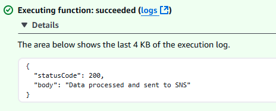

# NBA Game Day Notifications - 30 Day DevOps Challenge

## **Project Overview**
This project is an event driven alert system that sends real-time NBA game day score notifications to subscribed users via Email.

---

## **Features**
- Request is sent to fetch live NBA game info using the external NBA API.
- After response, the info is transformed into a human readable format and published to an Amazon SNS Topic.
- Game notifications are sent to subscribers through Email.
- Scheduled automation for regular updates & invoking using Amazon EventBridge.

## **Prerequisites**
- Free account with subscription and API Key at [sportsdata.io](https://sportsdata.io/)
- Personal AWS account (Free Tier)
- Basic understanding of AWS and Python

---

## **Technical Architecture**


---


## **Technologies**
- **Cloud Provider**: AWS
- **Core AWS Services**: SNS, Lambda, EventBridge
- **External API**: NBA Game API ([SportsData.io](https://sportsdata.io/))
- **Programming Language**: Python 3.x
- **IAM Security**:
  - Least privilege policies for Lambda, SNS, and EventBridge.

---

## **Project Structure**
```bash
game-day-notifications/
├── src/
│   ├── nba_notifications.py          # Main Lambda function code
├── policies/
│   ├── nba_sns_policy.json           # SNS publishing permissions
│   ├── nba_eventbridge_policy.json   # EventBridge to Lambda permissions
│   └── nba_lambda_policy.json        # Lambda execution role permissions
├── .gitignore
└── README.md                        # Project documentation
```

## **Setup Instructions**

### **Clone the Repository**
```bash
git clone https://github.com/Peterkinywa/game-day-notifications
cd game-day-notifications
```

### **Create an SNS Topic**
1. Open AWS Management Console, navigate to SNS, and create a topic (e.g., `nba_topic`).

### **Add Subscriptions to the SNS Topic**
1. Select the topic, click "Create subscription", and enter a valid email address.
2. Confirm the subscription via the email link.

### **Create the SNS Publish Policy**
1. In IAM, go to Policies → Create Policy.
2. Paste the JSON policy from `nba_sns_policy.json`, replacing `REGION` and `ACCOUNT_ID`.
3. Name the policy (e.g., `nba_sns_policy.json`) and create it.

### **Create an IAM Role for Lambda**
1. In IAM, go to Roles → Create Role.
2. Select AWS Service → Lambda.
3. Attach `nba_sns_policy` and `AWSLambdaBasicExecutionRole`.
4. Name the role (e.g., `nba_role`) and create it.
5. Save the role ARN.

### **Deploy the Lambda Function**
1. In Lambda, click "Create Function".
2. Name it (e.g., `nba_notifications`), choose Python 3.13, and assign `nba_role`.
3. Copy code from `src/nba_notifications.py` into the editor and deploy.
4. Add environment variables: `NBA_API_KEY` and `SNS_TOPIC_ARN`.
5. Create the function.

### **Set Up Automation with EventBridge**
1. In EventBridge, create a rule with Event Source: Schedule.
2. Set the cron schedule (e.g., `cron (0/10 8-23 * * ? *)`).
3. Select the Lambda function (`nba_notifications`) as the target.

### **Test the System**
1. Create a test event in Lambda and run it.
2. Verify SMS notifications are sent to subscribers.



This project was designed with security in mind, following the principle of least privilege for IAM roles.

## Happy Developing!
